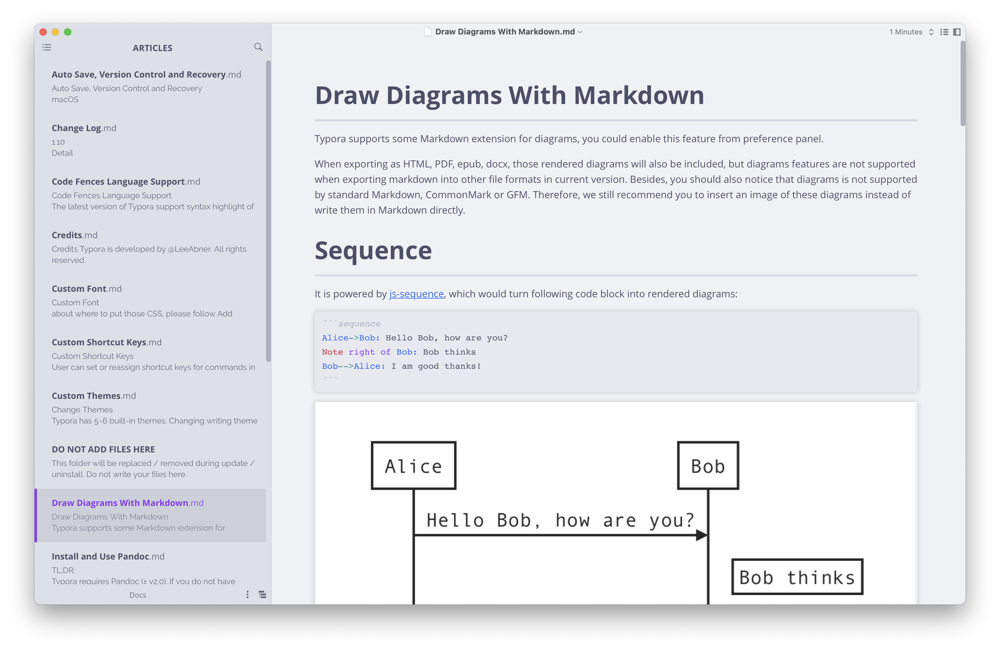
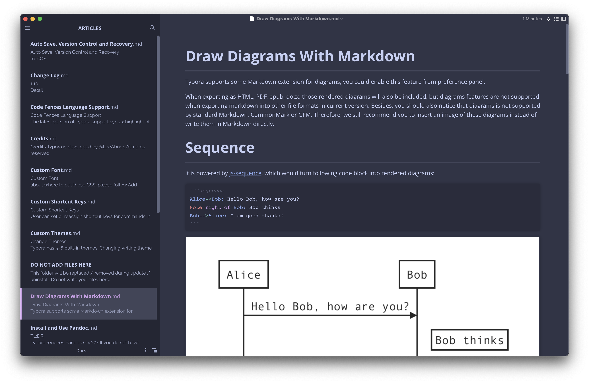
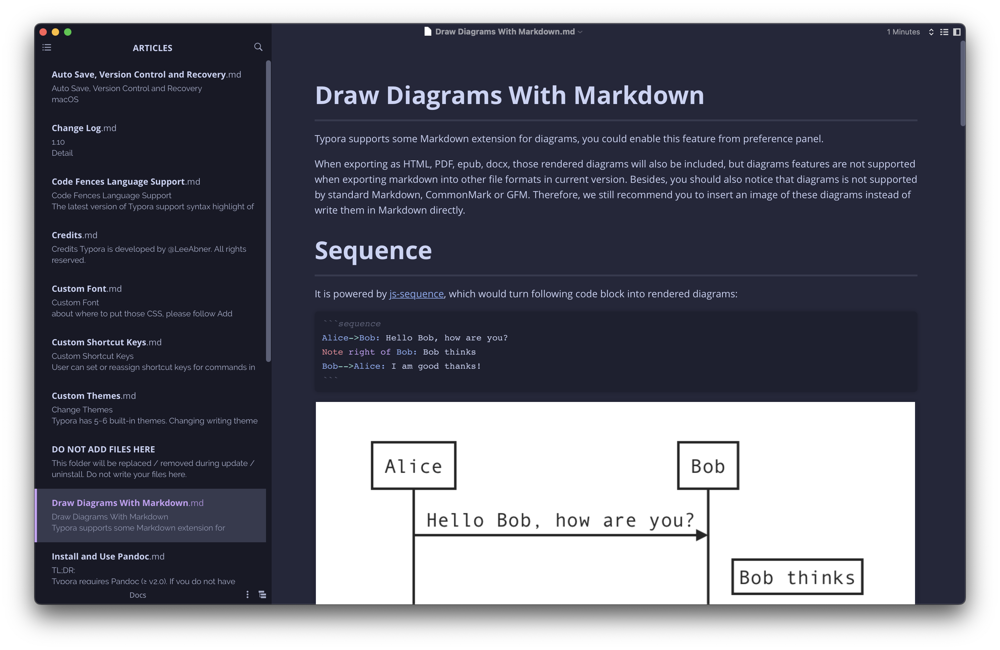
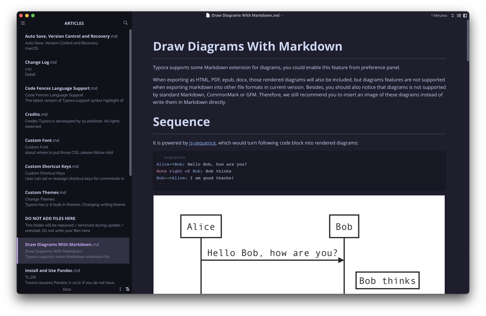

<h3 align="center">
	 
	
	Catppuccin for <a href="https://typora.io">Typora</a>
	
</h3>

	
	
	

	

## Previews

🌻 Latte

🪴 Frappé

🌺 Macchiato

🌿 Mocha

## Usage

1. Download or clone this repo.
2. Place the contents of the `theme` dir into the Typora theme directory.
   - Open Typora and go to **Settings/Preferences** > **Appearance** > **Open Theme Folder**.
   - Make sure you have the catppuccin directory along with each flavor's CSS file.
3. Select the theme from Typora in **Preferences** > **Appearance**.

More info can be found in the <a href="https://theme.typora.io/doc">Typora docs</a>.

## 💝 Thanks to

- [Stephan Lamoureux](https://github.com/stephanlamoureux)

&nbsp;

	

	Copyright &copy; 2021-present <a href="https://github.com/catppuccin" target="_blank">Catppuccin Org</a>

	

