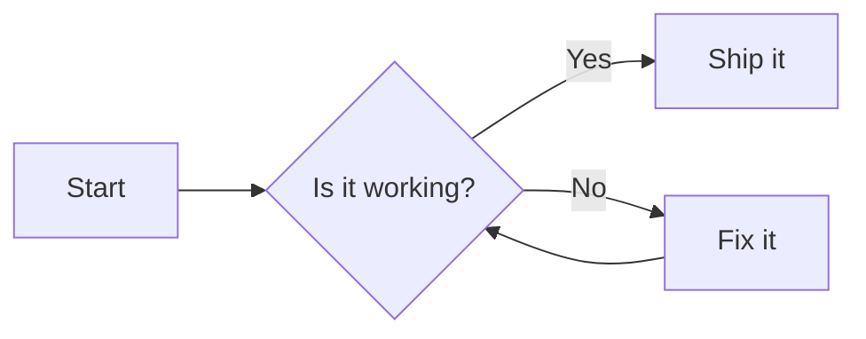
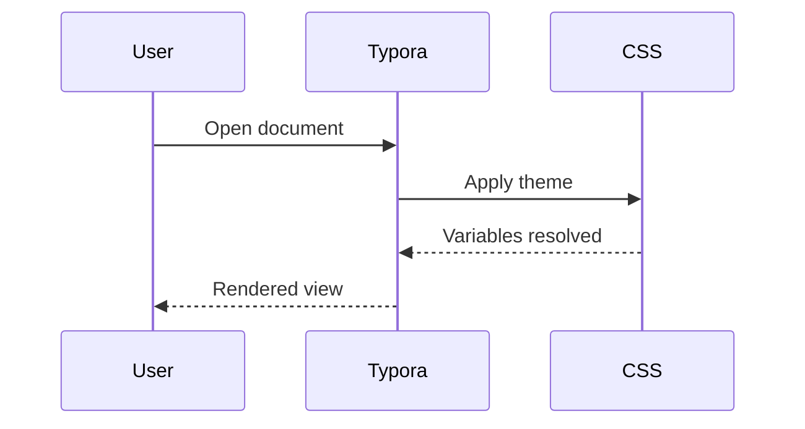
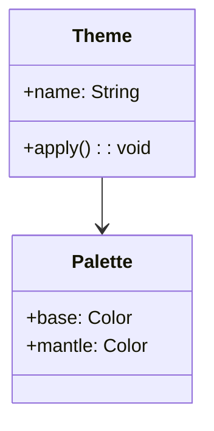
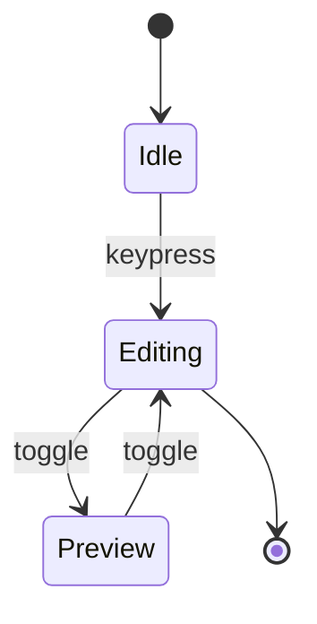
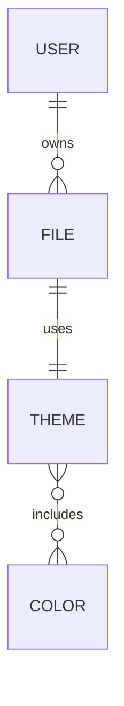
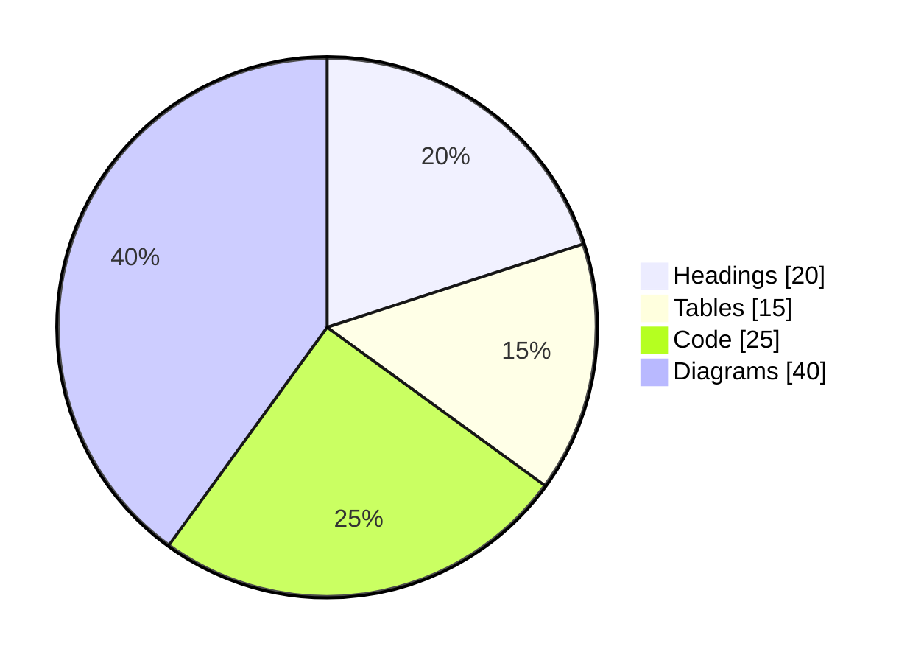
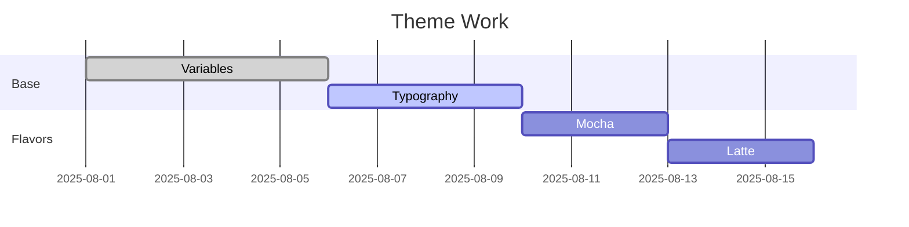
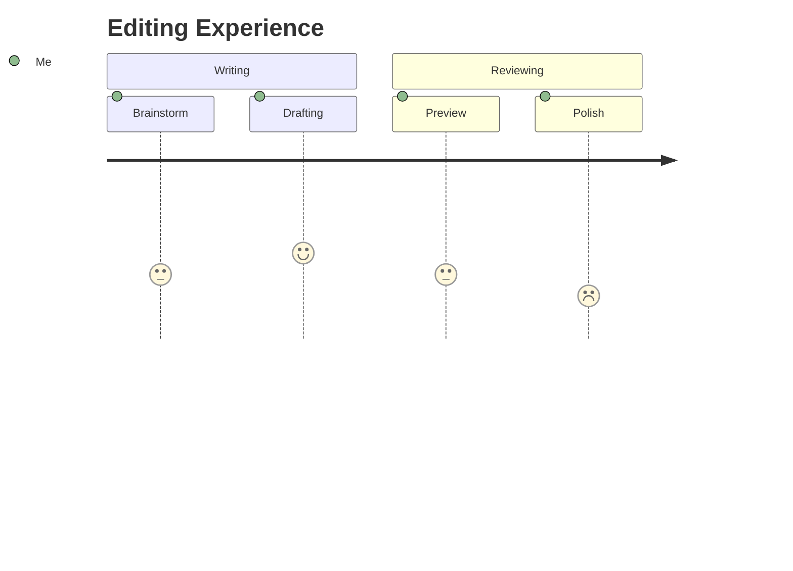

[TOC]

# H1 Heading
## H2 Heading
### H3 Heading
#### H4 Heading
##### H5 Heading
###### H6 Heading

Paragraph with **bold**, *italic*, ***bold-italic***, ~~strikethrough~~, `inline code`, ==highlight== (if supported), and a footnote reference[^demo].

> Blockquote level 1
>> Blockquote level 2 (nested)
>
> Back to level 1

---

## Lists

### Unordered
- Item A
- Item B
  - Nested B.1
  - Nested B.2
- Item C

### Ordered
1. First
2. Second
   1. Second.1
   2. Second.2
3. Third

### Task list
- [ ] Unchecked task
- [x] Done task
- [ ] Task with a very long label to see wrapping behavior in the sidebar and content area
  - [ ] Nested unchecked
  - [x] Nested done

---

## Links & Images

Inline link: <https://typora.io> and [Catppuccin](https://github.com/catppuccin).

Image (remote):


Image (with title):  


---

## Code

Inline `code` and a fenced block:

```bash
# Bash sample
echo "Hello, Typora!"
ls -la
```

```json
{
  "name": "typora-theme-test",
  "version": "1.0.0",
  "private": true
}
```

### Syntax-highlighted samples

```javascript
function greet(name) {
  const msg = `Hello, ${name}!`;
  console.log(msg);
  return msg;
}
greet("Typora");
```

```python
def fib(n):
    a, b = 0, 1
    out = []
    while len(out) < n:
        out.append(a)
        a, b = b, a+b
    return out

print(fib(10))
```

---

## Tables

### Basic
| Column A | Column B | Column C |
|---------:|:--------:|----------|
|   Right  |  Center  | Left     |
|     1234 |    foo   | bar      |
|       56 |  **baz** | *qux*    |

### Wide Content & Code
| Key | Value |
|-----|-------|
| PATH | `/usr/local/bin:/usr/bin:/bin:/usr/sbin:/sbin` |
| JSON | ```{"k":"v","arr":[1,2,3]}``` |

---

## Footnotes

Text with a footnote reference again[^another].

[^demo]: This is a demo footnote with **formatting**.
[^another]: Another footnote. Great for testing superscripts and spacing.

---

## Math (KaTeX/MathJax)

Inline: \( e^{i\pi} + 1 = 0 \) and \( \int_0^1 x^2\,dx = \frac{1}{3} \).

Display:

$$
\\mathbf{A} =
\\begin{bmatrix}
1 & 2 \\\\
3 & 4
\\end{bmatrix}
\\qquad
\\det(\\mathbf{A}) = -2
$$

Aligned:

$$
\\begin{aligned}
f(x) &= x^2 + 2x + 1 \\\\
     &= (x+1)^2
\\end{aligned}
$$

---

## HTML Blocks

<div style="padding:8px;border:1px solid; border-radius:6px;">
  <strong>HTML block</strong> to test theme styles for embedded HTML.
  <p>Includes <em>inline elements</em> and <code>inline code</code>.</p>
</div>

---

## Mermaid Diagrams

> Tip: Make sure Typora’s Mermaid is enabled.

### Flowchart


### Sequence


### Class Diagram


### State Diagram


### ER Diagram


### Pie


### Gantt


### Journey


---

## “flow” & “sequence” (Typora diagram plug-ins)

```flow
st=>start: Start
e=>end: End
op=>operation: Edit
cond=>condition: Looks good?

st->op->cond
cond(yes)->e
cond(no)->op
```

```sequence
Title: Simple Sequence
Alice->Bob: Hello Bob, how are you?
Note right of Bob: Bob thinks
Bob-->Alice: I am good thanks!
```

---

## Callouts / Admonitions (if enabled)

> **Note:** Some Typora versions/ports style admonitions differently.
>
> **Warning:** This is a warning-styled block (test colors).
>
> **Tip:** Try hovering buttons and links to see hover variables in action.

---

## Miscellaneous

- Emoji: 😸 🎉 ✅ ✨
- Horizontal rules:
---
***
___

Keyboard: Press <kbd>Ctrl</kbd> + <kbd>F</kbd> to search.

Inline math with text: The variance \( \sigma^2 = \mathbb{E}[X^2] - \mu^2 \).
